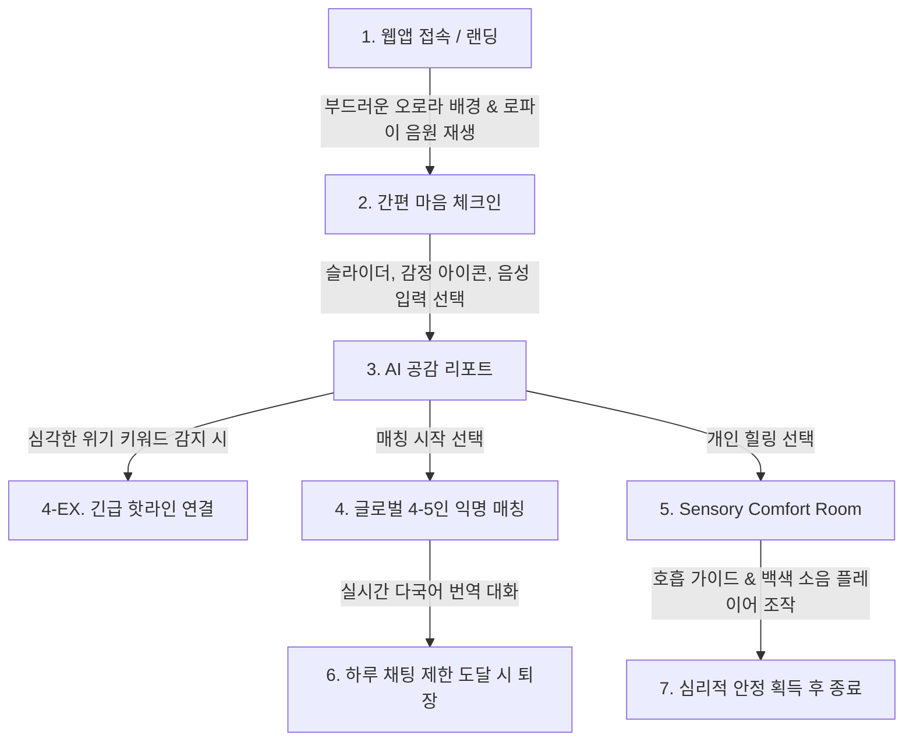

# Mini-PRD: MindLighthouse (마음의 등대)

학업 스트레스와 번아웃으로 고통받는 전 세계 청소년들을 위한 실시간 AI 공감 제안 및 익명 글로벌 또래 공감 디지털 대피소.

---

## 1. Objective (목적과 타깃)

### 1.1. 목적 (Objective)
- **정서적 고립감 해소 및 자살 예방**: 과도한 성적 압박 및 번아웃으로 위기에 처한 청소년들에게 **안전하고 낙인 효과 없는 익명의 디지털 대피소(Sanctuary)**를 제공합니다.
- **정신건강 서비스 장벽 완화**: 무겁고 두려운 기존 상담 방식 대신, 몇 번의 터치와 음성, 감성적인 공간 구성을 통해 심리적 진입 장벽을 완전히 허뭅니다.
- **글로벌 연대감 형성**: 실시간 번역 기술을 활용해 전 세계의 또래들과 "나만 혼자가 아니다"라는 위로와 동질감을 공유하게 합니다.

### 1.2. 타깃 사용자 (Target Audience)
- **전 세계 중·고등학생 및 대학생 (만 13세 ~ 24세 청소년)**
  - 학업 성적 및 입시 스트레스로 극심한 불안을 겪는 학생
  - 우울감이나 번아웃을 느끼지만, 주변에 말하기 두려워 고립된 학생
  - 활자 읽기가 힘들거나 신체적/감각적 자극에 민감하여 텍스트 중심 서비스에 피로감을 느끼는 학생

---

## 2. Scope (범위)

이번 버전(MVP)에서 개발할 핵심 기능 3가지(+위기 차단막)와 당장 구현하지 않고 보류할 기능을 정의합니다.

### 2.1. 개발할 핵심 기능 (In-Scope)

#### 1) 다감각 스트레스 & 번아웃 체크인 (Interactive Check-in)
- **간편 입력**: 장문의 텍스트 입력 없이 **슬라이더 바**와 **직관적인 감정/스트레스 아이콘 터치**로 현재 상태 입력.
- **음성 인식 (STT)**: 짧게 한숨을 쉬거나 속마음을 말하면 음성을 텍스트로 변환하고 감정을 보듬어 주는 인터랙션 제공.
- **공감 리포트**: 현재의 번아웃 수준을 은유적으로 시각화(예: 날씨나 등대의 밝기)하고 부드러운 위로의 AI 공감 메시지 제안.

#### 2) 글로벌 또래 매칭 & 번역 소그룹 채팅 (Global Peer Shelter)
- **공감 매칭**: 마음 상태가 유사한 전 세계 청소년 **4~5명 단위의 익명 소그룹 자동 매칭**.
- **실시간 다국어 번역**: 각자 자국어로 편하게 대화하더라도 번역되어 보여 상호 간의 언어 장벽을 완전히 해소.
- **과도한 몰입 방지 (Time-out & Limit)**: 하루 대화 가능 횟수나 채팅방 유지 시간에 제한을 두어 학업에 지장을 주거나 앱에 과몰입하지 않도록 제어.

#### 3) 오감 힐링 공간 (Sensory Comfort Room & Sounds)
- **인터랙션 디자인**: 부드럽게 움직이는 오로라 백그라운드 애니메이션, 리듬에 맞춰 팽창하고 수축하는 호흡 유도 버블(Breathing Bubble).
- **편안한 사운드 스케이프**: 로파이(Lo-Fi) 비트, 백색소음(빗소리, 파도 소리, 숲 소리) 재생 및 볼륨 컨트롤 기능 내장.

#### 4) 위기 감지 및 전문 기관 연결 (Emergency Break) - *필수 안전망*
- **위험 신호 감지**: 마음 체크인 결과나 채팅 텍스트 내 자살, 자해 등 위험 키워드 감지 시 즉각 경고 작동.
- **글로벌 핫라인 매핑**: 각 국가별 검증된 긴급 전화번호 및 상담 채널 리스트를 긴급 팝업으로 노출하여 외부 전문 기관으로 즉시 인계.

---

### 2.2. 당장 구현하지 않을 기능 (Out-of-Scope)
- **가입 및 계정 연동**: 완벽한 익명성을 위해 이메일/소셜 로그인은 제외하며, 접속 시 임의의 닉네임(예: '빛나는 등대', '따뜻한 파도')을 부여.
- **음성/영상 라이브 채팅**: 서버 리소스 절약 및 사이버 불링(Cyber-bullying) 방지를 위해 실시간 음성/화상 통화는 제외하고, 번역 텍스트 기반 소통만 유지.
- **전문의 실시간 1:1 상담 연결**: 앱 내에서 의사나 전문 상담사와 1:1 매칭 채팅을 제공하는 대신, 검증된 핫라인 허브 페이지로 연결해 주는 역할만 담당.

---

## 3. User Flow (사용자 흐름)

1. **Step 1: Landing (마음의 등대 도착)**
   - 앱 접속 즉시 편안한 오로라 배경이 은은하게 퍼지며, 잔잔한 백색소음/로파이 음원이 자동 재생됩니다.
2. **Step 2: Check-in (마음 체크인)**
   - 번아웃 지수를 나타내는 부드러운 원형 슬라이더를 밀어 강도를 정하고, 6가지 스트레스 감정 아이콘 중 선택하거나 마이크 버튼을 눌러 짧은 심경을 말합니다.
3. **Step 3: AI Empathy Report & Matching Route (공감과 연결)**
   - AI가 공감하고 도출해낸 나의 마음 날씨와 번아웃 수준이 보이고, 두 가지 옵션이 제공됩니다: **"세계의 또래들과 이야기 나누기"** 또는 **"나만의 힐링 공간으로 들어가기"**.
   - *이 단계에서 심각한 단어가 감지되면, 즉각 핫라인 연결 버튼이 최상단에 고정 표시됩니다.*
4. **Step 4-A: Peer Chatroom (익명의 연대)**
   - '세계의 또래와 대화'를 누르면, 비슷한 마음 등급을 가진 글로벌 청소년 4~5명이 속한 방에 입장합니다. 내가 한국어로 입력하면 상대방에겐 영어, 스페인어, 일본어 등으로 실시간 자동 번역되어 전송됩니다. 하루에 3번의 대화 전송 한도가 차면 더 이상 대화를 쓸 수 없고, 공부방으로 돌아가도록 유도합니다.
5. **Step 5-B: Sensory Comfort Room (오감의 쉼터)**
   - '나만의 힐링 공간'을 누르면 시각적 자극이 최소화된 공간에서 오로라 불빛을 보며 마우스를 갖다 대거나 화면을 터치할 때마다 영롱한 사운드 피드백을 받고, 호흡 가이드(들숨/날숨 버블)에 따라 심호흡을 진행합니다.

---

## 4. UI/UX Vibe (Stitch/UI 생성용 영문 프롬프트)

사용자 인터페이스 및 비주얼 테마 생성을 위해 **Stitch 등 AI UI 툴에 최적화된 영문 디자인 프롬프트**입니다.

> **Prompt:**
> "A comforting, premium, and highly interactive digital sanctuary web application UI dashboard. The background features a gorgeous, slow-moving aurora borealis gradient consisting of deep violet, soft teal, light rose, and midnight indigo, creating a peaceful and hypnotic sky effect. Minimalist glassmorphism panels with very soft translucent white blur, glowing borders, and rounded corners. The center contains a smooth, glowing, breathing-guide bubble that slowly expands and contracts. Soft hand-drawn outline icons of emotions (tired, anxious, sad, hopeful). A clean top bar with ambient soundtrack controls for adjusting lo-fi music and ocean wave white noise. Modern, clean typography using Inter or Outfit, styled with crisp white and warm pastel colors. Safe, deeply relaxing, therapeutic, non-triggering, and premium digital aesthetic."

---

## 5. Verification Plan (검증 및 테스트 시나리오)

- **시나리오 1: 무입력/단순 입력 스트레스 체크인 검증**
  - 사용자가 키보드 입력 없이 마우스/터치 슬라이더와 감정 아이콘 클릭만으로 정상적으로 마음 공감 리포트를 보는지 확인.
- **시나리오 2: 다국어 번역 및 소그룹 매칭 시뮬레이션**
  - 한 사용자가 한국어로 작성한 메시지가 다른 시뮬레이션 클라이언트(예: 영어권 사용자) 창에 번역되어 올바르게 출력되는지 확인.
  - 일일 대화 제한이 차단 장벽 역할을 하여 초과 전송이 제한되는지 검증.
- **시나리오 3: 위기 방지 필터링 검증**
  - '자살', '자해', 'suicide' 등 고위험군 키워드 입력 시, 매칭 채팅 프로세스가 일시 정지되거나 눈에 띄는 팝업 형태로 긴급 상담 번호(1393, 988 등)가 안내되는지 체크.
- **시나리오 4: 백색 소음 플레이어 및 호흡 버블 원활성 테스트**
  - 로파이 비트와 자연 소리의 오디오 토글/볼륨 조절이 깨짐 없이 동작하는지 확인.
  - 호흡 애니메이션 프레임 드랍이 없고 시각적으로 충분히 부드러운지 확인.
